# Robot Assembler

## 基本操作と画面構成

### 基本操作
- __視点の回転__ 左ドラッグ
- __平行移動__ ホイールドラッグ もしくは スペースキー + 左ドラッグ
- __拡大と縮小__ ホイールスクロール

### 画面構成


## モデルを作成する
任意のパーツを選択して配置を決めていくことで、ロボットのモデルを作ることができます。

ここでは、サーボモーターにフレームを取り付ける例を用いて説明していきます。

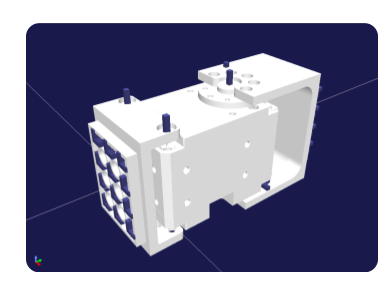

### パーツを配置する
右側のリストにある各パーツのボタンを押すと、3Dビュー上にパーツが現れます。

「Servo Parts (X-series)」タブにある、「Dynamixel XL-430」を配置してみましょう。

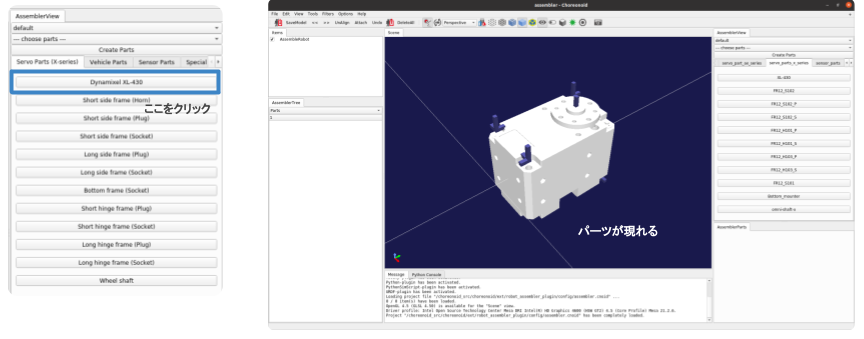

同様に「Servo Parts (X-series)」タブにある、「Short hinge frame (Plug)」を配置します。

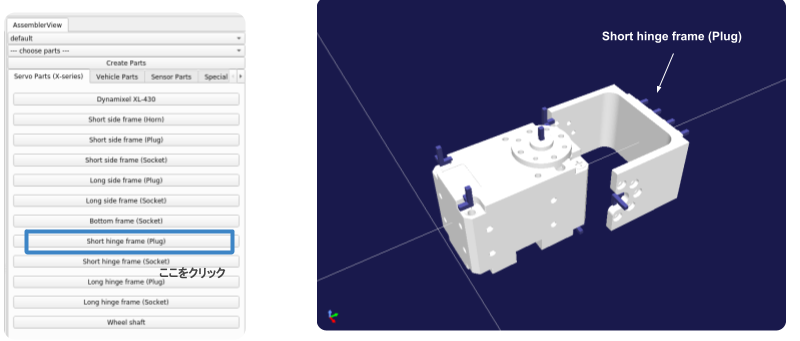

### パーツをアタッチする

紫色の突起は、他のパーツとの接続が可能な点を表しています。

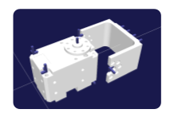

サーボモータのホーンにある突起を左クリックで選択しましょう。
選択した箇所は赤色になり、それと対応可能な箇所が水色で表示されます。
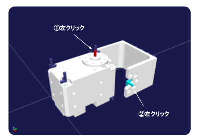

水色になった箇所を左クリックすると2つとも緑色に変わり、
アタッチ（取り付け）が可能な状態となります。

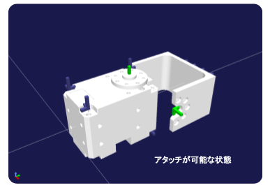

左上のツールバーにある矢印（Alignボタン）をクリックすると
固定可能な向きを実際に確認することができます。

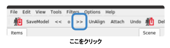

複数回クリックすることで固定する向きが順番に変わります。

*Note*
この状態ではまだパーツはアタッチされていません。（固定されていない状態）

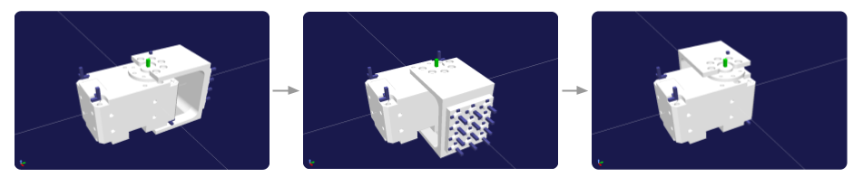

取り付ける向きが問題ないことを確認したら、
「Attach」ボタンをクリックして、パーツを固定します。

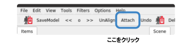

アタッチを行うと、2つのパーツが新しいパーツに置き換わります。


### アタッチの順番を決める
2つのパーツをアタッチすると、片方が親パーツとなり、もう片方は子パーツとなります。
親はアタッチ後も位置や向きが変わらないのに対し、子は位置や向きが親に合わせて変わります。
親パーツ、子パーツは設定によって変わります。
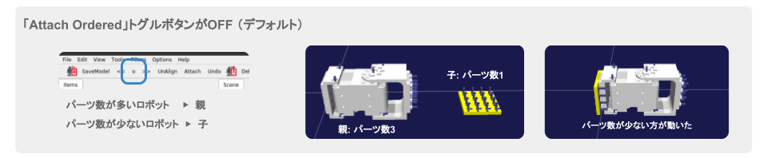
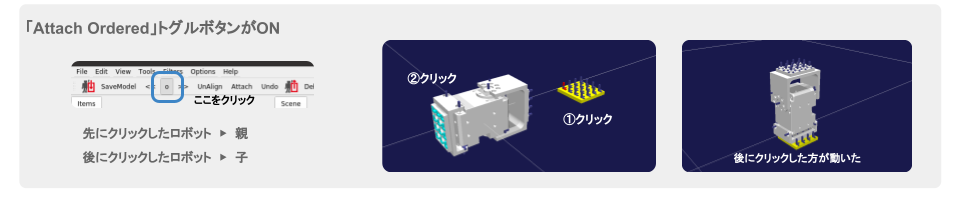

### アタッチしたパーツを取り外す

パーツを右クリックして「Detach Parts」を選択することで、アタッチ後のパーツを取り外すことができます。
*Note*
Alignの操作を取り消したいときは、一度アタッチしてから、ディタッチで取り外してください。

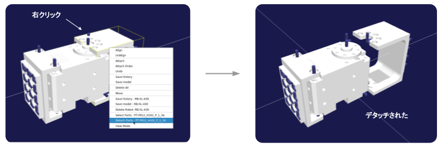

### パーツを削除する
パーツを右クリックして「Delete Robot」を選択することで、配置したパーツを削除することができます。

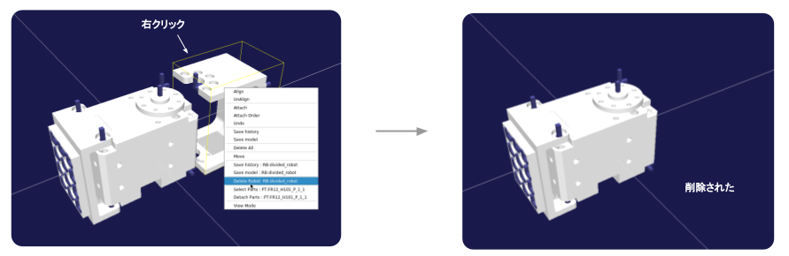


### パーツのリンク名や色を変更する
Robot assemblerでパーツのリンク名を変更することで、シミュレーションで使用するリンク名をわかりやすくすることができます。また、パーツの色も変更することができます。

アイテムツリーからロボットを選択し、アセンブラツリーで```Link```を選択し、名称や色を変えたいパーツを選択します。
情報パネルで名称や色の値を変えてください。色は```[red, green, blue]```の順番で入力し、0から1の値で指定してください。

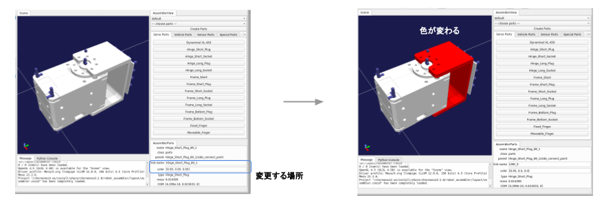

### アクチュエーターの角度を変更する
アイテムツリーからロボットを選択し、アセンブラツリーで```Actuator```を選択し、角度を変更したい場所を選択します。
情報パネルの```current-angle```に値をラジアンで入力しEnterキーを押すことで角度が変わります。
また、```initial-angle```を変更することでシミュレーションで使用する時の初期角度を変更できます。

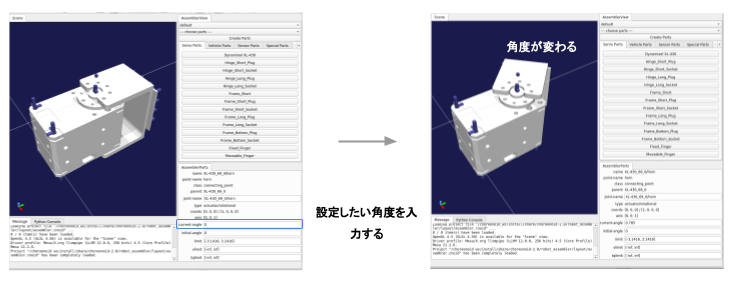

### 作成したモデルを保存する
本プラグインで作成したモデルは「.roboasm」という拡張子のファイルで管理されます。
ツールバーの「Save History」アイコンをクリックして、モデルを保存しましょう。
ファイルの保存場所は、ルートディレクトリにある「userdir」フォルダの中を指定してください。

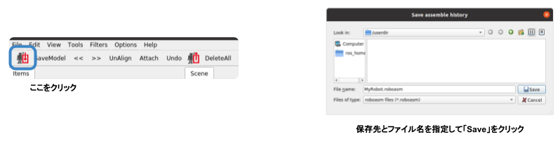


### 保存したモデルを読み込む
モデルをファイルに保存しておくことで、後から読み込んで編集することが可能です。
保存したモデルを読み込むには、ツールバーの「Load History」アイコンをクリックします。

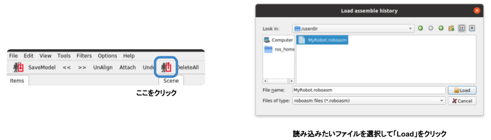

### 同じモデルファイルを複数読み込む

同じ.roboasmファイルを同時に複数読み込みたい場合は、
「Files of type」で「roboasm files / parts renamed」を選択してください。


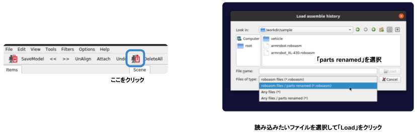


### モデルをBodyファイルに書き出す
Choreonoidではモデルファイルの標準フォーマットとしてBodyファイルが用いられています。

Bodyファイルに書き出すには、まずツールバーの「SaveModel」をクリックします。
「Files of type」で「body files」を選択してください。

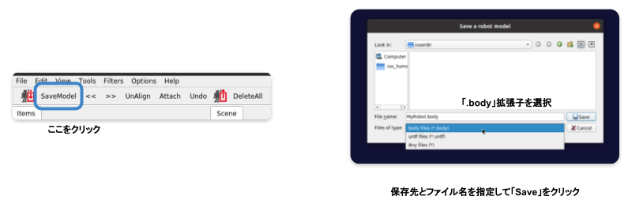
